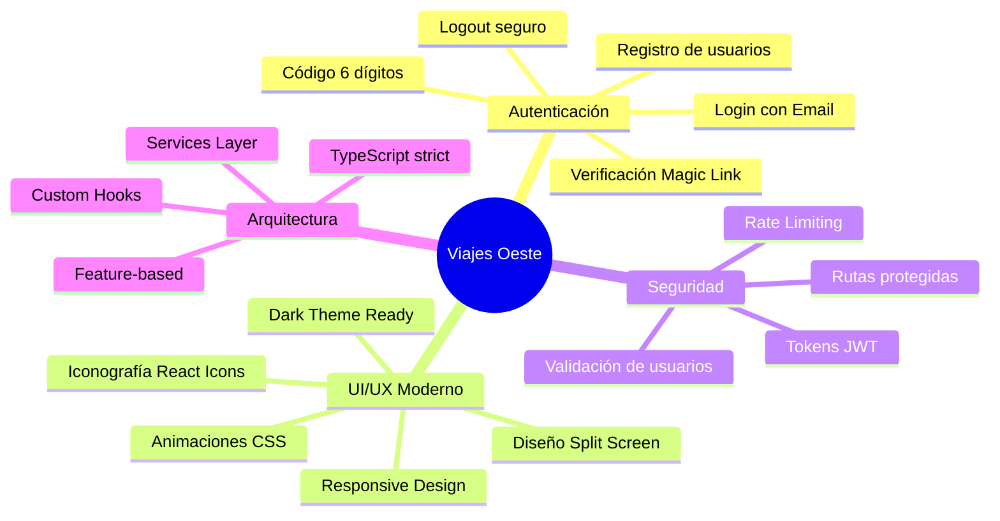
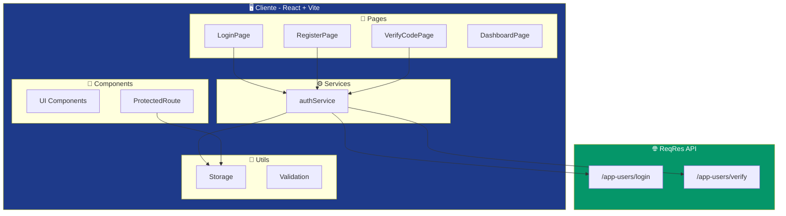
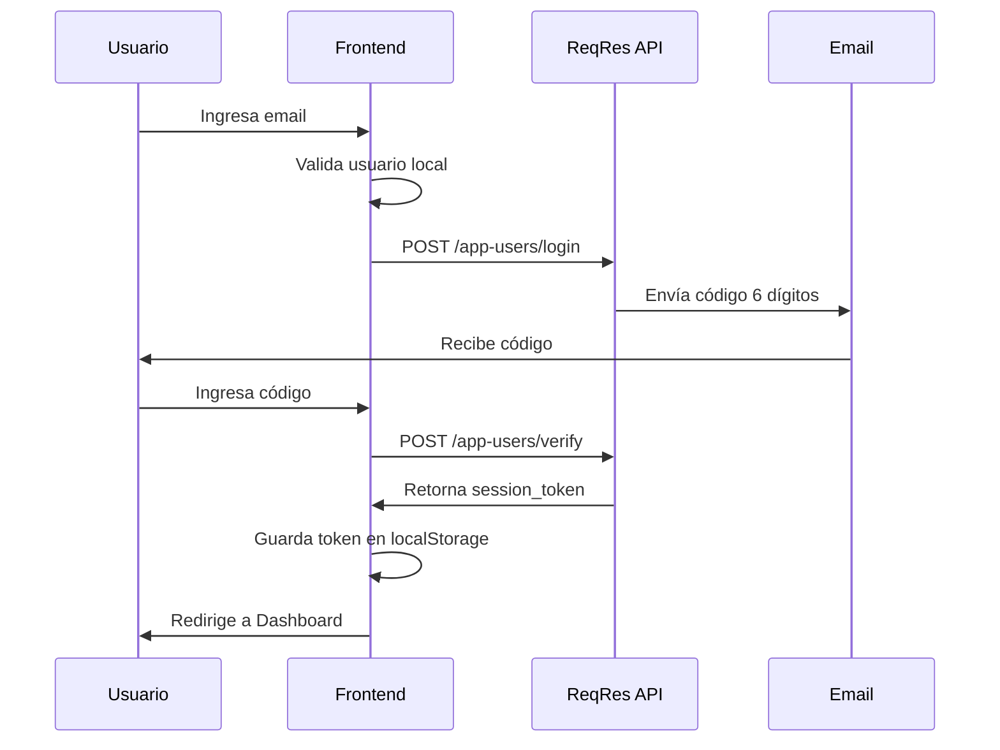
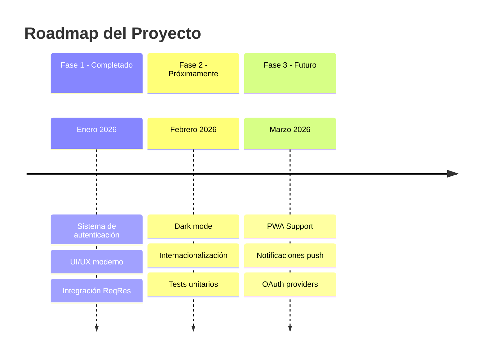

<picture>
  <source media="(prefers-color-scheme: dark)" srcset="https://capsule-render.vercel.app/api?type=waving&color=gradient&customColorList=2,3,12,19,20&height=180&section=header&text=Viajes%20Oeste&fontSize=50&fontColor=ffffff&animation=fadeIn&fontAlignY=35&desc=Sistema%20de%20Autenticación%20Moderno&descSize=18&descAlignY=55">
  <source media="(prefers-color-scheme: light)" srcset="https://capsule-render.vercel.app/api?type=waving&color=gradient&customColorList=2,3,12,19,20&height=180&section=header&text=Viajes%20Oeste&fontSize=50&fontColor=ffffff&animation=fadeIn&fontAlignY=35&desc=Sistema%20de%20Autenticación%20Moderno&descSize=18&descAlignY=55">
  
</picture>

<div align="center">


**Aplicación web moderna de autenticación para agencia de viajes con verificación por código de 6 dígitos**

[Demo](#-demo) • [Características](#-características) • [Instalación](#-instalación) • [Documentación](#-documentación)

</div>

---

## 📑 Tabla de Contenidos

- [🎯 Descripción General](#-descripción-general)
- [✨ Características](#-características)
- [🛠️ Stack Tecnológico](#️-stack-tecnológico)
- [🏗️ Arquitectura](#️-arquitectura)
- [📁 Estructura del Proyecto](#-estructura-del-proyecto)
- [⚡ Instalación](#-instalación)
- [⚙️ Configuración](#️-configuración)
- [🎮 Demo](#-demo)
- [📖 Documentación](#-documentación)
- [🔐 Flujo de Autenticación](#-flujo-de-autenticación)
- [🎨 Capturas de Pantalla](#-capturas-de-pantalla)
- [🗺️ Roadmap](#️-roadmap)
- [👨‍💻 Autor](#-autor)
- [📄 Licencia](#-licencia)

---

## 🎯 Descripción General

**Viajes Oeste** es una aplicación web moderna que implementa un sistema de autenticación completo utilizando **Magic Link** con verificación por código de 6 dígitos. Diseñada con las mejores prácticas de desarrollo frontend, ofrece una experiencia de usuario fluida y segura.

### 🎯 Objetivo del Proyecto

Demostrar la implementación de un flujo de autenticación moderno y seguro, aplicando arquitectura escalable y patrones de diseño profesionales en React.

---

## ✨ Características

<div align="center">



</div>

### 🔑 Funcionalidades Principales

| Característica | Descripción |
|----------------|-------------|
| 🔐 **Autenticación Segura** | Sistema de login con verificación por código de 6 dígitos enviado al email |
| 📝 **Registro de Usuarios** | Creación de cuentas nuevas con validación de email único |
| 🛡️ **Rutas Protegidas** | Acceso restringido al dashboard solo para usuarios autenticados |
| 🎨 **UI Profesional** | Diseño moderno con split-screen, gradientes y animaciones |
| 📱 **Responsive** | Adaptable a todos los tamaños de pantalla |
| ⚡ **Rate Limiting** | Manejo inteligente de límites de la API |

---

## 🛠️ Stack Tecnológico

<div align="center">

### Frontend Core

| Tecnología | Versión | Propósito |
|------------|---------|-----------|
|  | 18.3.1 | Biblioteca UI |
|  | 5.6.2 | Tipado estático |
|  | 6.0.5 | Build tool |

### Dependencias Principales

| Paquete | Propósito |
|---------|-----------|
| `react-router-dom` | Enrutamiento SPA |
| `axios` | Cliente HTTP |
| `react-icons` | Iconografía |

### Herramientas de Desarrollo

| Herramienta | Propósito |
|-------------|-----------|
| ESLint | Linting de código |
| TypeScript ESLint | Reglas TS |
| Vite Plugin React | HMR y Fast Refresh |

</div>

---

## 🏗️ Arquitectura

<div align="center">



</div>

### 📐 Patrón de Arquitectura

El proyecto sigue una **arquitectura basada en features** (Feature-based Architecture):

```
src/
├── features/          # Módulos por funcionalidad
│   └── auth/          # Feature de autenticación
├── components/        # Componentes compartidos
├── api/              # Configuración HTTP
├── utils/            # Utilidades globales
└── app/              # Configuración de la app
```

---

## 📁 Estructura del Proyecto

```
agencia-viajes-oeste-frontend-react-vite-auth/
│
├── 📂 src/
│   ├── 📂 api/
│   │   └── 📄 client.ts              # Cliente Axios configurado
│   │
│   ├── 📂 app/
│   │   ├── 📄 AppRoutes.tsx          # Definición de rutas
│   │   └── 📄 ProtectedRoute.tsx     # HOC para rutas protegidas
│   │
│   ├── 📂 components/
│   │   └── 📂 ui/
│   │       ├── 📄 Alert.tsx          # Componente de alertas
│   │       ├── 📄 Button.tsx         # Botón reutilizable
│   │       ├── 📄 TextInput.tsx      # Input de texto
│   │       └── 📄 index.ts           # Barrel exports
│   │
│   ├── 📂 features/
│   │   └── 📂 auth/
│   │       ├── 📂 pages/
│   │       │   ├── 📄 LoginPage.tsx      # Página de login
│   │       │   ├── 📄 RegisterPage.tsx   # Página de registro
│   │       │   ├── 📄 VerifyCodePage.tsx # Verificación de código
│   │       │   ├── 📄 DashboardPage.tsx  # Panel principal
│   │       │   └── 📄 *.css              # Estilos por página
│   │       │
│   │       ├── 📂 services/
│   │       │   └── 📄 authService.ts # Lógica de autenticación
│   │       │
│   │       └── 📂 types/
│   │           └── 📄 index.ts       # Tipos TypeScript
│   │
│   ├── 📂 styles/
│   │   ├── 📄 tokens.css             # Variables CSS (Design Tokens)
│   │   └── 📄 global.css             # Estilos globales
│   │
│   ├── 📂 utils/
│   │   ├── 📄 storage.ts             # Manejo de localStorage
│   │   └── 📄 validation.ts          # Validaciones
│   │
│   ├── 📄 App.tsx                    # Componente raíz
│   └── 📄 main.tsx                   # Entry point
│
├── 📄 index.html
├── 📄 package.json
├── 📄 tsconfig.json
├── 📄 vite.config.ts
└── 📄 README.md
```

---

## ⚡ Instalación

### Prerrequisitos

- **Node.js** >= 18.0.0
- **npm** >= 9.0.0 o **yarn** >= 1.22.0
- **Git**

### Pasos de Instalación

```bash
# 1. Clonar el repositorio
git clone https://github.com/RodrigoSanchezDev/agencia-viajes-oeste.git

# 2. Navegar al directorio
cd agencia-viajes-oeste-frontend-react-vite-auth

# 3. Instalar dependencias
npm install

# 4. Iniciar servidor de desarrollo
npm run dev
```

### Scripts Disponibles

| Comando | Descripción |
|---------|-------------|
| `npm run dev` | Inicia servidor de desarrollo en `localhost:5173` |
| `npm run build` | Genera build de producción |
| `npm run preview` | Previsualiza build de producción |
| `npm run lint` | Ejecuta ESLint |

---

## ⚙️ Configuración

### Variables de Entorno

El proyecto utiliza la API de ReqRes. La configuración se encuentra en `src/api/client.ts`:

```typescript
// Configuración de ReqRes
export const PROJECT_ID = 'tu_project_id';
export const API_KEY = 'tu_api_key';
```

### Obtener Credenciales de ReqRes

1. Visita [https://reqres.in](https://reqres.in)
2. Crea una cuenta gratuita
3. Crea un nuevo proyecto
4. Copia el `Project ID` y `API Key`
5. Actualiza `src/api/client.ts`

---

## 🎮 Demo

### Cómo Probar

1. Regístrate con tu email personal
2. Inicia sesión con el email registrado
3. Revisa tu bandeja de entrada para obtener el código
4. Ingresa el código de 6 dígitos
5. Accede al Dashboard

> **Nota:** El sistema utiliza ReqRes API para el envío de códigos de verificación.

---

## 📖 Documentación

### 🔐 Flujo de Autenticación

<div align="center">



</div>

### 🔒 Manejo de Sesión

```typescript
// Verificar autenticación
authService.isAuthenticated() // boolean

// Cerrar sesión
authService.logout() // void

// Obtener token
getToken() // string | null
```

---

## 🎨 Capturas de Pantalla

<div align="center">

### 🔑 Login Page
*Diseño split-screen con formulario minimalista y hero image*

### ✅ Verification Page  
*Inputs de código con auto-focus y soporte para paste*

### 🏠 Dashboard
*Panel de usuario con navegación lateral y tarjetas de destinos*

</div>

---

## 🗺️ Roadmap

<div align="center">



</div>

### ✅ Completado

- [x] Sistema de login con Magic Link
- [x] Verificación por código de 6 dígitos
- [x] Registro de usuarios
- [x] Rutas protegidas
- [x] UI profesional responsive
- [x] Manejo de rate limiting

### 🔜 Próximamente

- [ ] Modo oscuro
- [ ] Soporte multi-idioma (i18n)
- [ ] Tests con Vitest
- [ ] Storybook para componentes
- [ ] CI/CD con GitHub Actions

---

## 👨‍💻 Autor

<div align="center">


### **Rodrigo Sánchez**
#### Full Stack Developer

<br/>

[](https://sanchezdev.com/)
[](mailto:Rodrigo@sanchezdev.com)

[](https://www.linkedin.com/in/sanchezdev)
[](https://www.sanchezdev.com/documents/CV-Espanol.html)

[](https://www.sanchezdev.com/es/agenda)

<br/>

*¿Tienes una idea de proyecto? Conversemos cómo puedo ayudarte.*

</div>

---

## 📄 Licencia

Este proyecto está bajo la Licencia MIT. Consulta el archivo [LICENSE](LICENSE) para más detalles.

---

<picture>
  <source media="(prefers-color-scheme: dark)" srcset="https://capsule-render.vercel.app/api?type=waving&color=gradient&customColorList=2,3,12,19,20&height=120&section=footer">
  <source media="(prefers-color-scheme: light)" srcset="https://capsule-render.vercel.app/api?type=waving&color=gradient&customColorList=2,3,12,19,20&height=120&section=footer">
  
</picture>

<div align="center">

**⭐ Si este proyecto te resultó útil, considera darle una estrella en GitHub ⭐**

© 2026 [Rodrigo Sánchez](https://sanchezdev.com) — All rights reserved.

</div>
